# UAP AnalyticsBot

[](https://github.com/aj1126/UAP_AnalyticsBot/actions/workflows/test.yml)
[](https://github.com/aj1126/UAP_AnalyticsBot/actions/workflows/docs.yml)
[](https://nodejs.org/)
[](https://opensource.org/licenses/ISC)
[](#)
[](#)

## Pipeline Overview

```mermaid
flowchart LR
    subgraph INGEST ["🔍 Ingestion Layer"]
        direction TB
        A1["📄 Text & Documents\n.txt .md .json .csv .log .pdf"]
        A2["🖼️ Images\n.png .jpg .jpeg"]
        A3["🎬 Video\n.mp4 — keyframes + Whisper"]
        A4["🔊 Audio ⚠️ Planned\n.mp3 .wav .ogg .flac"]
    end

    subgraph NORM ["⚙️ Normalization"]
        direction TB
        B1["Recursive walkFiles()"]
        B2["Worker Thread Pool"]
        B3["Fingerprint Cache"]
        B4["OCR Fallback (MuPDF → Tesseract)"]
        B5["Word Condensation ⚠️ Planned\nStemming · Possessives · Plurals"]
    end

    subgraph ANALYZE ["📊 Analytics Engine"]
        direction TB
        C1["🟦 Descriptive\nTerm Freq · Dates · Locations"]
        C2["🟨 Diagnostic\nTF-IDF · Cosine Similarity"]
        C3["🟧 Predictive\nWeighted Moving Avg · Forecasting"]
        C4["🟥 Prescriptive\nAnomalies · Recommendations"]
    end

    subgraph OUTPUT ["📤 Output Layer"]
        direction TB
        D1["JSON stdout"]
        D2["Markdown Report"]
        D3["CSV Export"]
        D4["Web GUI Dashboard"]
    end

    INGEST --> NORM --> ANALYZE --> OUTPUT
```



## Feature Roadmap

| # | Feature | Status |
|---|---|:---:|
| | **Ingestion** | |
| — | Text / Document ingestion (`.txt` `.md` `.pdf` `.csv` `.log`) | ✅ Complete |
| — | Image OCR ingestion (`.png` `.jpg` via Tesseract) | ✅ Complete |
| — | MuPDF rasterization fallback for corrupted/scanned PDFs | ✅ Complete |
| — | Multithreaded worker pool + fingerprint cache | ✅ Complete |
| — | Video ingestion — keyframe OCR + Whisper transcription (`.mp4`) | ✅ Complete |
| [#19](https://github.com/aj1126/UAP_AnalyticsBot/issues/19) | Unified audio ingestion (standalone `.mp3`/`.wav` + video audio tracks) | 🔵 Planned |
| [#20](https://github.com/aj1126/UAP_AnalyticsBot/issues/20) | Advanced video content analysis — object detection, scene classification, motion estimation | 🔵 Planned |
| | **NLP & Normalization** | |
| — | NLP entity extraction — dates & locations via `compromise` | ✅ Complete |
| — | TF-IDF weighting + cosine similarity diagnostic tier | ✅ Complete |
| — | Weighted moving average predictive forecasting | ✅ Complete |
| [#21](https://github.com/aj1126/UAP_AnalyticsBot/issues/21) | Recursive word condensation — possessives, plurals, stemming, case dedup | 🔵 Planned |
| | **Output & Delivery** | |
| — | JSON, Markdown, and CSV report delivery | ✅ Complete |
| — | Directory watch mode (`--watch`) via chokidar | ✅ Complete |
| — | Local Web GUI with browser-based directory browsing | ✅ Complete |
| — | Telemetry pipeline — GitHub webhook ingestion & subagent handoff | ✅ Complete |
| | **Infrastructure** | |
| — | GitHub Actions CI (test + docs) | ✅ Complete |
| — | 1-click Windows install (`install.bat`) + diagnostics tool | ✅ Complete |
| — | DataPools API — ingestion management & SQLite persistence | ✅ Complete |

> **Legend:** ✅ Complete · 🔵 Planned · ⚠️ Partially implemented

---

## Table of Contents

- [Pipeline Overview](#pipeline-overview)
- [Feature Roadmap](#feature-roadmap)
- [Quick Start](#quick-start)
- [Core Loop: Ingest -> Analyze -> Report](#core-loop-ingest---analyze---report)
- [Analytics Scope](#analytics-scope)
- [Core Features](#core-features)
- [Telemetry & Extension Pipeline](#telemetry-extension-pipeline)
- [Current Implementation](#current-implementation)
- [CLI Runtime Behavior](#cli-runtime-behavior)
- [Command Reference](#command-reference)
- [Supported File Types](#supported-file-types)
- [Repository Layout](#repository-layout)
- [Testing](#testing)
- [Documentation Workflow](#documentation-workflow)
- [Non-Destructive Guarantee](#non-destructive-guarantee)
- [Notes for Contributors and Copilot](#notes-for-contributors-and-copilot)
- [Installation & Setup](#installation-setup)
- [Alternative & Manual Installation](#alternative-manual-installation)
  - [Manual Setup](#manual-setup)
- [Usage](#usage)
  - [Alternative / Command Line Runners](#alternative-command-line-runners)
  - [Watch Mode](#watch-mode)
  - [Report Generation](#report-generation)
  - [Advanced Usage](#advanced-usage)
- [Troubleshooting & Diagnostics](#troubleshooting-diagnostics)
- [Planned Technical Optimizations](#planned-technical-optimizations)
  - [1. Performance & Infrastructure](#1-performance-infrastructure)
  - [2. Algorithmic Depth (Diagnostic Tier)](#2-algorithmic-depth-diagnostic-tier)
  - [3. Data Integrity & NLP](#3-data-integrity-nlp)
  - [4. Predictive & Prescriptive Enhancements](#4-predictive-prescriptive-enhancements)

[↑ Back to Top](#uap-analyticsbot)


## Quick Start

Get the pipeline running in four commands. For full installation options and output formats, see the [User Guide](docs/USER_GUIDE.md).

```bash
git clone https://github.com/aj1126/UAP_AnalyticsBot.git
cd UAP_AnalyticsBot
npm install
npm start -- /path/to/your/documents --format=md
```

[↑ Back to Top](#uap-analyticsbot)


## Core Loop: Ingest -> Analyze -> Report

UAP AnalyticsBot is a file-first analytics system built around a repeatable three-stage loop:

1. **Ingest**: Discover source files from a target folder using read-only access.
2. **Analyze**: Extract and model text + metadata into analytics outputs.
3. **Report**: Produce structured summaries and recommendations for decision-making.

This loop is the domain model Copilot should assume when assisting in this repository.

[↑ Back to Top](#uap-analyticsbot)


## Analytics Scope

The analysis stage is intentionally split into four tiers:

1. **Descriptive**: What happened? (term frequencies, glossaries, dates, locations)
2. **Diagnostic**: Why did it happen? (correlations across terms, dates, and locations)
3. **Predictive**: What is likely to happen? (trend forecasting from historical timestamps)
4. **Prescriptive**: What should we do? (actionable recommendations and data-quality flags)

[↑ Back to Top](#uap-analyticsbot)


## Core Features

* **Multi-Format Ingestion:** Natively processes `.txt`, `.md`, `.json`, `.csv`, `.log`, and `.pdf` files.
* **WebAssembly OCR Fallback:** Automatically detects scanned government PDFs and dynamically rasterizes pages into images via `mupdf` (running completely natively in the V8 engine) before passing them to Tesseract for optical character recognition.
* **Intelligent Noise Filtering:** Utilizes a static $O(1)$ Stop-Word and artifact culling pass at the ingestion layer to strip grammatical glue and OCR noise, ensuring perfectly clean downstream analytics.
* **Multi-Tiered Analytics:**
  * **Descriptive:** Top keywords, location extraction, and timeline mapping.
  * **Diagnostic:** Location-based keyword clustering.
  * **Predictive:** Next-likely location hotspots based on frequency modeling.
  * **Prescriptive:** Automated recommendations for folder restructuring and missing metadata alerts.
* **Automated Markdown Reporting:** Formats raw JSON telemetry into a clean, human-readable intelligence report.

[↑ Back to Top](#uap-analyticsbot)


## Telemetry & Extension Pipeline

UAP AnalyticsBot features a repository operational telemetry parsing, storage, and agent-spawning pipeline to continuously stream and monitor developer workflows.

* **Database Ingestion (`src/telemetry/db.js`)**: Manages the local SQLite database (`uap_telemetry.db`) to store raw webhook payloads, calculated metrics, and anomaly events.
* **Metric Ingestion & Extraction (`src/telemetry/ingestion.js`)**: Parses GitHub webhook events (e.g. pull request and push actions) to extract velocity and churn metrics (like cycle velocities, codebase churn ratios, and commit success frequencies).
* **Validation & Drift Detection (`src/telemetry/analytics.js`)**: Detects metric drift, legacy environment configurations, and registers alerts in the SQLite database.
* **Virtual Subagent delegation (`src/telemetry/handoff.js`)**: Simulates the `invoke_subagent` task handoff routine, formatting and forwarding analytical telemetry to AI agents.
* **E2E Simulation (`verify.js`)**: A standalone script that injects mock webhook payloads, executes analysis, updates the database, and prints a final telemetry execution report.

[↑ Back to Top](#uap-analyticsbot)


## Current Implementation

The active implementation is a Node.js CLI that:

- resolves the source directory from the first CLI argument, or defaults to the current working directory
- recursively scans supported text files in read-only mode
- extracts words, dates, locations, and file metadata
- builds descriptive, diagnostic, predictive, and prescriptive analytics
- emits a formatted JSON report to standard output

See [docs/architecture.md](docs/architecture.md) for the current-vs-planned architecture view. Historical Python prototype details live in [docs/legacy-prototype.md](docs/legacy-prototype.md).

[↑ Back to Top](#uap-analyticsbot)


## CLI Runtime Behavior

On a successful run, the CLI prints a JSON report to stdout that includes:

- `sourceDirectory`
- `descriptive`
- `diagnostic`
- `predictive`
- `prescriptive`

If an error occurs, the CLI prints the error message to stderr and exits with a non-zero status.

[↑ Back to Top](#uap-analyticsbot)


## Command Reference

<!-- GENERATED:commands:START -->
| Command | Purpose |
| --- | --- |
| `npm start -- /absolute/path/to/source-folder` | Run the active Node CLI and emit a JSON analytics report. |
| `npm test` | Run the current Node test suite. |
| `npm run docs:generate` | Refresh autogenerated documentation sections. |
| `npm run docs:check` | Verify autogenerated docs are current and that required documentation references remain valid. |
| `npm run release` | Auto-generate CHANGELOG.md, bump the semantic version, and create a Git release tag based on conventional commit history. |
<!-- GENERATED:commands:END -->

[↑ Back to Top](#uap-analyticsbot)


## Supported File Types

The current Node ingestion pipeline only analyzes text-oriented files.

<!-- GENERATED:supported-file-types:START -->
| Extension | Status |
| --- | --- |
| `.txt` | Ingested by the active Node pipeline |
| `.md` | Ingested by the active Node pipeline |
| `.json` | Ingested by the active Node pipeline |
| `.csv` | Ingested by the active Node pipeline |
| `.log` | Ingested by the active Node pipeline |
| `.pdf` | Ingested by the active Node pipeline |
| `.png` | Ingested by the active Node pipeline |
| `.jpg` | Ingested by the active Node pipeline |
| `.jpeg` | Ingested by the active Node pipeline |
<!-- GENERATED:supported-file-types:END -->

[↑ Back to Top](#uap-analyticsbot)


## Repository Layout

<!-- GENERATED:repo-layout:START -->
- `src/index.js` — Node CLI entry point.
- `src/pipeline.js` — Pipeline coordinator that assembles all analytics tiers.
- `src/ingestion/file-ingestion.js` — Read-only recursive file ingestion for supported files.
- `src/analytics/` — Descriptive, diagnostic, predictive, and prescriptive analytics modules.
- `src/telemetry/db.js` — SQLite Database Layer for storing repository telemetry.
- `src/telemetry/ingestion.js` — Telemetry Ingestion Engine for parsing webhook events.
- `src/telemetry/analytics.js` — Telemetry Analytics and Drift Detection.
- `src/telemetry/handoff.js` — Subagent Handoff Simulator (simulates invoke_subagent).
- `verify.js` — E2E simulation script for telemetry extension.
- `test/pipeline.test.js` — Node test coverage for core pipeline behavior.
- `test/telemetry.test.js` — Test suite for telemetry extension.
- `docs/architecture.md` — Hand-authored architecture overview for current and planned system design.
- `docs/legacy-prototype.md` — Historical Python prototype reference.
- `docs/ROADMAP.md` — Active development tracker and planned stages.
- `docs/USER_GUIDE.md` — Installation and execution instructions for end-users.
<!-- GENERATED:repo-layout:END -->

[↑ Back to Top](#uap-analyticsbot)


## Testing

The current Node test suite verifies that:

- the full analytics report is produced for supported text fixtures
- dates and locations are extracted into analytics outputs
- prescriptive recommendations flag files with missing metadata

Run `npm test` to execute the existing suite.

[↑ Back to Top](#uap-analyticsbot)


## Documentation Workflow

- Narrative documentation stays hand-authored.
- Command reference, supported file types, and repository layout are generated from repository metadata.
- Run `npm run docs:generate` after changing documented commands, supported file types, or layout metadata.
- Run `npm run docs:check` before submitting changes; the repository is configured to enforce this on pull requests and releases.

[↑ Back to Top](#uap-analyticsbot)


## Non-Destructive Guarantee

The bot must never modify, move, or delete ingested source files. Ingestion is read-only by design.

[↑ Back to Top](#uap-analyticsbot)


## Notes for Contributors and Copilot

- Keep ingestion logic modular and separate from analytics logic.
- Prefer asynchronous and streaming patterns for large datasets.
- Preserve strict read-only behavior for source directories.
- When adding analytics, classify behavior under one of the four analytics tiers.
- Update [docs/architecture.md](docs/architecture.md) when implementation changes affect current-vs-planned system boundaries.


<br>

[↑ Back to Top](#uap-analyticsbot)


## Installation & Setup

> [!IMPORTANT]
> ### ⚡ Windows 1-Click Setup (Recommended)
> Simply double-click the **`install.bat`** file at the root of the project.
> This automatically verifies, downloads, and installs Node.js, npm, and all dependencies.

---

<br>

[↑ Back to Top](#uap-analyticsbot)


## Alternative & Manual Installation
If you prefer command-line setups or are on a non-Windows platform:

- **Windows PowerShell (Automated)**: Run the following in PowerShell:
```powershell
Set-ExecutionPolicy Bypass -Scope Process -Force; .\setup.ps1
```


### Manual Setup
**Prerequisites:** Ensure you have [Node.js](https://nodejs.org/) installed (version 18, 20, or 22+ recommended).

1. **Clone the repository:**
```bash
git clone https://github.com/aj1126/uap_analyticsbot.git
cd uap_analyticsbot
```

2. **Install dependencies:**
This project installs as a standard Node.js CLI package, so there are no extra native build steps required for the current worker-thread ingestion flow. Simply run:
```bash
npm install
```


3. **Verify the installation:**
Run the local test suite to ensure the multithreaded worker pool and caching engine are functioning correctly on your machine:
```bash
npm test

```


*(If all tests pass green, you are ready to start analyzing documents!)*


---

<br>

[↑ Back to Top](#uap-analyticsbot)


## Usage

> [!TIP]
> ### 🎨 Visual Web Dashboard (Recommended)
> Simply double-click **`gui.bat`** at the root of the project.
> This spins up the local server and automatically launches your default browser to browse directories, run analyses, and view telemetry metrics.

---

<br>

### Alternative / Command Line Runners

#### 1-Click / Drag-and-Drop Runner
To run the terminal bot without typing commands:
- **Drag-and-Drop**: Drag any data folder directly onto **`run.bat`** in Windows Explorer.
- **Double-click**: Double-click **`run.bat`** and paste the folder path when prompted.

#### Command Line Interface (CLI)
To run the AnalyticsBot via command line, pass the target directory containing your files as the first argument:

```bash
node src/index.js ./my_folder/
```

By default, this will parse the documents and output a formatted JSON report directly to your console.

### Watch Mode

Keep the pipeline running in the background. It will automatically re-analyze the documents and recalculate the math whenever you add, edit, or delete a file in the target directory:

```bash
node src/index.js ./my_folder/ --watch

```

### Report Generation

Instead of dumping JSON directly to the console, you can generate formatted report files that are automatically saved to the `/data_exports/` directory:

```bash
node src/index.js ./my_folder/ --format=md

```

*(Supports `md` for Markdown or `csv` for spreadsheet datasets).*


---
<br>

### Advanced Usage

The v1.2.0 AnalyticsBot engine supports multithreading and memoization caching. You can control these via CLI arguments:

* `node src/index.js ./my_folder --workers=4` : Manually set the number of Node.js worker threads (defaults to max CPU cores).
* `node src/index.js ./my_folder --clear-cache` : Bypasses the `.analytics_cache.json` file and forces a fresh read of all documents.
* `node src/index.js ./my_folder --format=csv` : Exports the final report as a spreadsheet-compatible `.csv` file.

<br>

[↑ Back to Top](#uap-analyticsbot)


## Troubleshooting & Diagnostics

If you encounter issues launching the Web GUI, installing packages, or running analyses:
1. Double-click **`diagnose.bat`** at the root of the project.
2. This runs comprehensive environment checks, package validation, database integrity checks, and network port analysis.
3. Review the terminal output or the generated **`diagnostics_report.txt`** file in the root folder for troubleshooting details.

<br>
<br>

[↑ Back to Top](#uap-analyticsbot)


## Planned Technical Optimizations

### 1. Performance & Infrastructure
*   **Multithreaded Ingestion**: Transition the CPU-bound WebAssembly and OCR tasks to a `Worker Pool` using `node:worker_threads` to achieve near-linear scaling on multi-core Windows 11 systems.
*   **Ingestion Caching**: Implement a fingerprinting system using file metadata (size + mtime) to cache extraction results in a `.analytics_cache.json` file, bypassing heavy processing for unchanged documents.

### 2. Algorithmic Depth (Diagnostic Tier)
*   **TF-IDF Weighting**: Implement Term Frequency-Inverse Document Frequency to mathematically penalize common stop-words and highlight unique, document-defining keywords[cite: 2].
*   **Semantic Similarity**: Utilize Cosine Similarity matrices to discover conceptual overlaps between separate PDF reports in the repository.

### 3. Data Integrity & NLP
*   **Entity Unification**: Enhance the normalization pass to merge variations of locations (e.g., "Mexico:", "Mexico's", and "MEXICO") into a single canonical token.
*   **Advanced Stop-Word Culling**: Expand the static $O(1)$ filter set to include common OCR artifacts and administrative government jargon.

### 4. Predictive & Prescriptive Enhancements
*   **Time-Series Clustering**: Group location hotspots by temporal quarters to improve the accuracy of the `likelyNextHotspot` forecast.
*   **Metadata Validation**: Extend data-quality flags to check for specific required fields in PDF `metadata.info` objects.