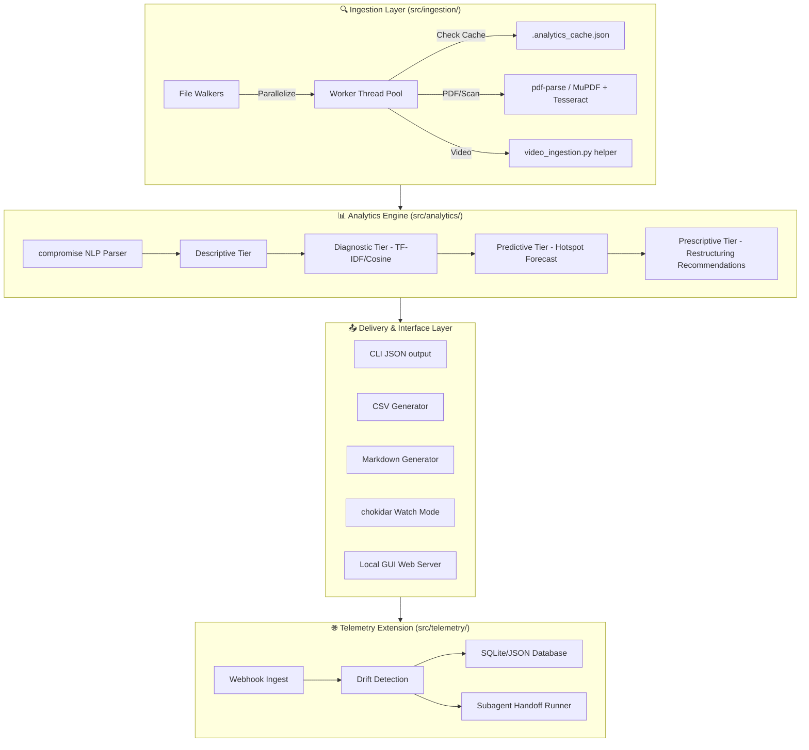

# Project Review: UAP_AnalyticsBot Telemetry Extension

This document provides a comprehensive review and architectural analysis of the `UAP_AnalyticsBot` project, highlighting its layout, code hygiene, test coverage, identified findings, and opportunities for optimization.

---

## 📊 Executive Summary

The `UAP_AnalyticsBot` is a robust file-first analytics system designed to ingest, process, and report on various telemetry documents (text, pdf, images, video, and webhooks). 

* **Overall Health:** **Excellent**
* **Active Language/Platform:** Node.js (v22.x target) + Python helper scripts
* **Test Suite Status:** 39 tests passing, 0 failing.
* **Code Coverage:** **86.51%** line coverage, **77.52%** branch coverage.
* **Runtime Dependability:** Uses Node 22 native `node:sqlite` when available, falling back to a custom JSON-based mock DB layer when running on older versions or isolated test runtimes.

---

## 🏛️ Architecture & Component Mapping

The project's pipeline follows a structured three-step domain loop: **Ingest ➔ Analyze ➔ Report**, augmented by telemetry tracking and real-time visualization:



### 1. Ingestion Layer
* **Text / Document ingestion:** Parses `.txt`, `.md`, `.json`, `.csv`, and `.log` files.
* **Worker Thread Pool:** Offloads file reading and parsing to background threads (`src/ingestion/worker.js`) to prevent blocking the main V8 event loop.
* **Cache Fingerprinting:** Utilizes MD5 hashing of file content to populate `.analytics_cache.json` for rapid incremental processing.
* **OCR & PDF Fallback:** Direct parsing of vector PDFs using `pdf-parse`. If text geometry is corrupted/scanned, it uses `mupdf` to rasterize page frames and passes the image buffers to `tesseract.js` for character recognition.
* **Multimedia Offloading:** Spawns a Python child process (`scripts/video_ingestion.py`) to extract video duration, demux audio tracks for Whisper transcription, and run keyframe OCR.

### 2. Analytics Engine
* **Entity Extraction:** Uses `compromise` NLP library for Named Entity Recognition (NER) to isolate `#Date` and `#Place` markers.
* **TF-IDF & Cosine Similarity:** Computes term frequencies across the document corpus to find contextual relationships between documents.
* **Predictive Modeling:** Models time-series trends using weighted moving averages to forecast the next likely hotspot regions.
* **Prescriptive Quality Audits:** Assesses file metadata schemas, automatically generating folder-restructuring warnings and tagging incomplete records.

### 3. Delivery Layer
* **Output Generators:** Supports stdout stream mapping, Markdown intelligence outputs, and flat-mapped CSV sheets for data science tools.
* **Live GUI Dashboard:** A local web server (`src/gui/server.js`) serving a responsive telemetry monitoring dashboard.

### 4. Telemetry Extension
* **Webhook Receiver:** Ingests external GitHub payload events (`push`, `pull_request`, `workflow_run`) to track cycle velocity and code churn.
* **Drift Detector:** Validates payload telemetry against baseline configuration rulesets (e.g., minimum required PR approvals, signed commits enforcement).
* **SQLite Persistence:** Saves event logs, alerts, and metrics to `uap_telemetry.db`.
* **Agent Handoff Runner:** Automates delegating tasks to virtual subagents via independent detached runner scripts.

---

## 🔍 Code Review & Engineering Findings

During our deep-dive analysis of the codebase, we uncovered the following key observations:

### 1. ⚙️ Worker Thread Safety and Graceful Teardown
* **Observation:** Project rules enforce wrapping `worker.terminate()` inside `setImmediate()` to prevent re-entrancy segfaults during isolate destruction.
* **Verdict:** ✅ **Conforms.** `src/ingestion/file-ingestion.js` (lines 142-145) correctly implements this safety wrapper, and the worker threads shut down without native V8 crash symptoms.

### 2. 🗃️ SQLite Database Isolation
* **Observation:** Tests are prohibited from mutating the primary database file (`uap_telemetry.db`).
* **Verdict:** ✅ **Conforms.** `test/telemetry.test.js` isolates its tests by setting `db.setDatabasePath(':memory:')`, routing database transactions to an ephemeral in-memory state.

### 3. 🚨 Hardcoded Paths in client scripts
* **Observation:** In `mcp_client_bridge.py` (line 50), the configuration path is hardcoded as:
  ```python
  config_file = r"E:\Repos\UAP_Analytics\config\mcp_tools_config.json"
  ```
  This points to `UAP_Analytics` instead of `UAP_AnalyticsBot`. While this is only in an example driver function, it could cause execution errors when run directly.
* **Recommendation:** Update the path to reference the active repository folder name: `UAP_AnalyticsBot`.

### 4. 🔤 Tesseract OCR Offline Isolation
* **Observation:** In `src/ingestion/worker.js`, `tesseract.js` is imported and called:
  ```javascript
  const ocrResult = await tesseract.recognize(imageBuffer, 'eng', { logger: () => {} });
  ```
  By default, `tesseract.js` attempts to download worker scripts and trained language models from its CDN. In air-gapped or network-throttled environments, this will result in hanging executions.
* **Recommendation:** The project already bundles `eng.traineddata` in the root path. The OCR loader should be configured to use local filesystem paths for both the language files and the tesseract worker module.

### 5. 🧪 Test Coverage Targets
* **Observation:** Although overall line coverage is at **86.51%**, specific core components have lower coverage metrics:
  * `src/ingestion/worker.js`: **36.12%** line coverage.
  * `src/datapools/datapool-db.js`: **62.31%** line coverage.
  * `src/gui/server.js`: **79.40%** line coverage.
* **Recommendation:** Expand unit testing targets for:
  * Worker error handling, actual PDF rasterization via `mupdf`, and image OCR branches.
  * Edge cases in raw sqlite data pool connections.
  * Router mock tests for the GUI dashboard server.

---

## 🛠️ Actionable Recommendations

To maintain the high software quality standards of the repository, we propose the following incremental changes:

1. **Path Correction:** Fix the hardcoded workspace folder path inside `mcp_client_bridge.py` to match the repository name `UAP_AnalyticsBot`.
2. **Offline OCR Resilience:** Modify the Tesseract initialization arguments inside `src/ingestion/worker.js` to read local assets and prevent network-bound requests.
3. **Coverage Enhancements:** Write additional unit tests for `worker.js` and `datapool-db.js` to push overall line coverage above 90%.
